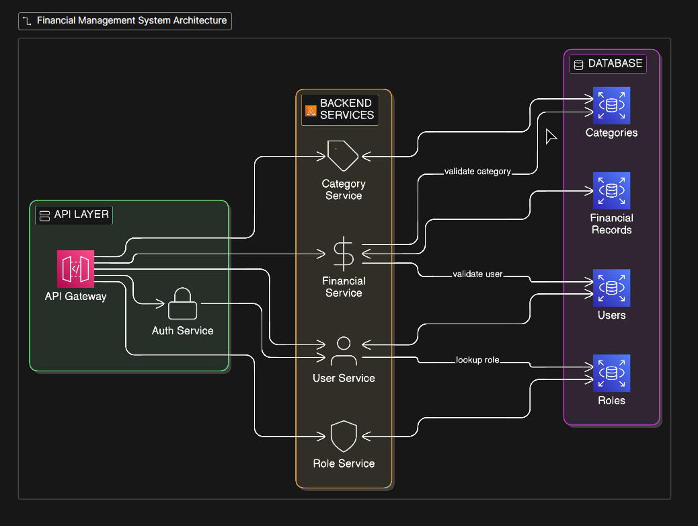

# Finance Dashboard System Backend

This project contains a TypeScript backend for a finance dashboard system using Express and PostgreSQL.

## High Level Architecture



Current scope implemented:

- Authentication using JWT tokens
- User creation and management
- Role assignment
- Active and inactive user status management
- Financial records management (CRUD + filtering + pagination + search + soft delete)
- Role-based access control (RBAC)
- Dashboard summary and analytics endpoints

## Tech Stack

- Express
- pg (PostgreSQL driver)
- TypeScript
- Bun for package management and script execution

## Role Model

- Viewer: Can view dashboard summary data
- Analyst: Can view dashboard summary and insights
- Admin: Can create and manage users, assign roles, manage financial records, and access all dashboard endpoints

## Access Control Logic

Access control is enforced at backend level using centralized policy checks in middleware.

Policy model:

- users.readSelf
- users.manage
- roles.read
- roles.manage
- records.read
- records.manage
- dashboard.read
- dashboard.readInsights

Role to policy mapping:

- Viewer
  users.readSelf, records.read, dashboard.read
- Analyst
  users.readSelf, records.read, dashboard.read, dashboard.readInsights
- Admin
  users.readSelf, users.manage, roles.read, roles.manage, records.read, records.manage, dashboard.read, dashboard.readInsights

These checks are applied through policy middleware across all route modules.

## Setup Process

1. Install prerequisites:

- Bun (latest stable)
- PostgreSQL 14+

2. Install dependencies:

```bash
bun install
```

3. Create environment file:

macOS/Linux:

```bash
cp .env.example .env
```

Windows PowerShell:

```powershell
Copy-Item .env.example .env
```

4. Configure environment variables in .env:

- Set DATABASE_URL to your PostgreSQL database.
- Set JWT_SECRET to a secure random value.
- Set BOOTSTRAP_ADMIN_PASSWORD to a strong password.

5. Ensure the target PostgreSQL database exists.

6. Start the server:

```bash
bun run dev
```

7. Open interactive API docs:

- Swagger UI: /api/docs
- Raw OpenAPI JSON: /api/docs.json

The API initializes required tables, indexes, roles, and a bootstrap admin user on startup.

## API Documentation

The project includes OpenAPI documentation powered by swagger-jsdoc and swagger-ui-express.

- The documentation content is written in a humanized style, so each endpoint explains what it does in practical terms.
- JWT-protected endpoints can be tested directly in Swagger UI by clicking Authorize and pasting a Bearer token.

## API Explanation

This backend is organized as modular route and service layers, with security and policy checks applied before business logic runs.

Request flow (typical protected endpoint):

1. Request enters Express app.
2. Rate limiting is applied on /api and stricter limits on /api/auth/login.
3. Router-level authenticate middleware validates JWT and loads current user.
4. authorizeAccess middleware checks role policy for the requested action.
5. Route-level validators parse query/body/path values.
6. Repository layer executes parameterized SQL queries in PostgreSQL.
7. API responds with JSON payloads and consistent error messages.

Module responsibilities:

- Auth module: login, current identity, effective permissions.
- Users module: user lifecycle and role/status management.
- Roles module: role catalog retrieval.
- Records module: record CRUD, filtering, search, pagination, soft-delete behavior.
- Dashboard module: aggregate analytics (totals, trends, category summaries).

Response conventions:

- Success responses typically return a data object.
- List responses can include filters and pagination metadata.
- Errors return a simple error message payload.

Data behavior highlights:

- Financial record deletion is soft delete (deleted_at), not physical deletion.
- Soft-deleted records are excluded from normal reads and analytics by default.
- Admin users can opt in to include deleted records in list queries.

## Assumptions Made

- Single-service deployment with one PostgreSQL database.
- Role model is fixed to viewer, analyst, and admin.
- JWT access token is sufficient for current scope (no refresh token flow yet).
- Record amounts are non-negative and record type (income or expense) determines meaning.
- API consumer handles timezone presentation on the frontend when needed.
- Bootstrap admin is acceptable for development and initial setup.

## Tradeoffs Considered

- Simplicity vs enterprise auth:
  JWT-only authentication is straightforward and fast to implement, but lacks session revocation and refresh token rotation.
- App-managed schema init vs formal migrations:
  Startup initialization is convenient for local development, but migration tooling is preferred for production change history and rollback.
- Flexible query filters vs strict query contract:
  Rich filtering and search improve usability, but require careful validation and index strategy as data grows.
- Soft delete vs hard delete:
  Soft delete improves auditability and recovery potential, but increases query complexity and storage over time.
- Global rate limit defaults vs per-tenant/per-user limits:
  IP-based limits are easy to operate initially, though advanced environments often need identity-aware throttling.

## Environment Variables

- PORT: Server port (default 4000)
- DATABASE_URL: PostgreSQL connection string
- DATABASE_SSL: true or false
- BOOTSTRAP_ADMIN_EMAIL: Seed admin email
- BOOTSTRAP_ADMIN_NAME: Seed admin full name
- BOOTSTRAP_ADMIN_PASSWORD: Seed admin password
- JWT_SECRET: Secret used to sign JWT access tokens
- JWT_EXPIRES_IN: Access token lifetime (for example 1h)

## Authentication Model

This implementation uses JWT Bearer tokens.

1. Call POST /api/auth/login with email and password.
2. Receive accessToken in response.
3. Pass token in Authorization header for protected routes:

```text
Authorization: Bearer <accessToken>
```

The authenticated user is loaded from database on each request and access is enforced by role.

## API Endpoints

### Auth

- POST /api/auth/login (Public)
- GET /api/auth/me (Any authenticated active user)
- GET /api/auth/permissions (Any authenticated active user)

### Roles

- GET /api/roles (Admin only)

### Users

- GET /api/users/me (Any authenticated active user)
- GET /api/users (Admin only)
- GET /api/users/:id (Admin only)
- POST /api/users (Admin only)
- PATCH /api/users/:id (Admin only)
- PATCH /api/users/:id/role (Admin only)
- PATCH /api/users/:id/status (Admin only)

### Dashboard

- GET /api/dashboard/summary (Viewer, Analyst, Admin)
- GET /api/dashboard/category-totals (Viewer, Analyst, Admin)
- GET /api/dashboard/recent-activity (Viewer, Analyst, Admin)
- GET /api/dashboard/trends (Viewer, Analyst, Admin)
- GET /api/dashboard/insights (Analyst, Admin)

Dashboard summary and analytics include:

- total income
- total expenses
- net balance
- category-wise totals
- recent activity feed
- monthly and weekly trends

### Financial Records

- POST /api/records (Admin only)
- GET /api/records (Viewer, Analyst, Admin)
- GET /api/records/:id (Viewer, Analyst, Admin)
- PATCH /api/records/:id (Admin only)
- DELETE /api/records/:id (Admin only)

Supported filters for GET /api/records:

- type: income or expense
- category: case-insensitive partial category match
- search: text search on category, notes, and type
- startDate: YYYY-MM-DD
- endDate: YYYY-MM-DD
- minAmount: minimum amount
- maxAmount: maximum amount
- page: page number (default 1)
- pageSize: page size (default 10, max 100)
- includeDeleted: include soft-deleted records (admin only)

Delete behavior:

- DELETE /api/records/:id performs a soft delete by setting deleted_at.
- Soft-deleted records are excluded from record listing, record fetch, updates, and dashboard analytics by default.

### Rate Limiting

- Global API rate limit: 300 requests per 15 minutes per IP on /api routes
- Login rate limit: 10 failed login attempts per 15 minutes per IP on /api/auth/login

### Health

- GET /health

## Example User Creation Request

1. Login with the bootstrap admin account:

```bash
curl -X POST http://localhost:4000/api/auth/login \
	-H "Content-Type: application/json" \
	-d '{
		"email": "admin@finance.local",
		"password": "Admin@12345"
	}'
```

2. Use the returned access token to create a user:

```bash
curl -X POST http://localhost:4000/api/users \
	-H "Content-Type: application/json" \
	-H "Authorization: Bearer <accessToken>" \
	-d '{
		"fullName": "Jane Analyst",
		"email": "jane.analyst@finance.local",
		"password": "JanePass!123",
		"role": "analyst",
		"isActive": true
	}'
```

3. Create a financial record:

```bash
curl -X POST http://localhost:4000/api/records \
	-H "Content-Type: application/json" \
	-H "Authorization: Bearer <accessToken>" \
	-d '{
		"amount": 1250.75,
		"type": "income",
		"category": "Consulting",
		"date": "2026-04-01",
		"notes": "Project invoice"
	}'
```

4. Filter financial records:

```bash
curl "http://localhost:4000/api/records?type=expense&category=travel&search=taxi&startDate=2026-01-01&endDate=2026-12-31&minAmount=50&maxAmount=2000&page=1&pageSize=20" \
	-H "Authorization: Bearer <accessToken>"
```

5. Fetch dashboard summary:

```bash
curl http://localhost:4000/api/dashboard/summary \
	-H "Authorization: Bearer <accessToken>"
```

6. Fetch category-wise totals:

```bash
curl "http://localhost:4000/api/dashboard/category-totals?type=expense&limit=10" \
	-H "Authorization: Bearer <accessToken>"
```

7. Fetch trends (monthly or weekly):

```bash
curl "http://localhost:4000/api/dashboard/trends?groupBy=monthly&periods=12" \
	-H "Authorization: Bearer <accessToken>"
```
